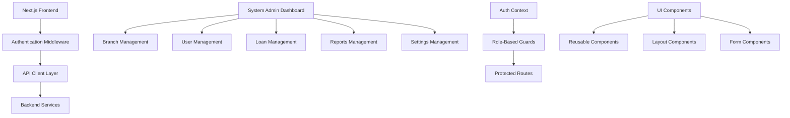
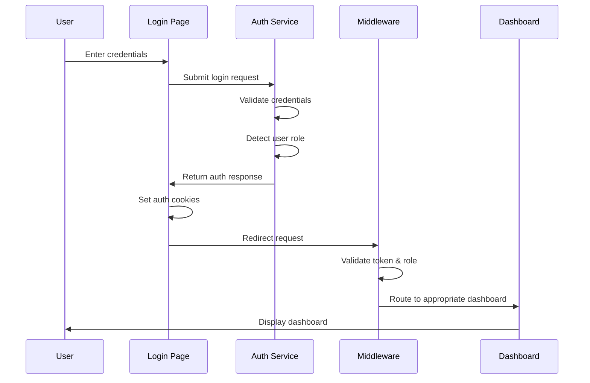
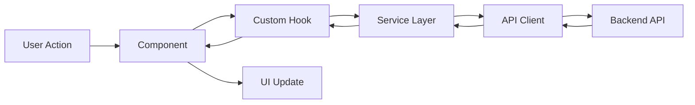

# Kaytop System Admin Documentation

## Table of Contents

1. [Executive Summary](#executive-summary)
2. [System Architecture](#system-architecture)
3. [Authentication & Authorization](#authentication--authorization)
4. [Core Features](#core-features)
5. [API Integration](#api-integration)
6. [User Interface Components](#user-interface-components)
7. [Data Management](#data-management)
8. [Security Implementation](#security-implementation)
9. [Performance Optimization](#performance-optimization)
10. [Testing Strategy](#testing-strategy)
11. [Deployment & Configuration](#deployment--configuration)
12. [Maintenance & Monitoring](#maintenance--monitoring)
13. [Future Roadmap](#future-roadmap)

---

## Executive Summary

The Kaytop System Admin module is a comprehensive financial management dashboard built with Next.js 16 and React 19, designed specifically for system administrators to oversee and manage all aspects of the financial platform. This MVP implementation provides complete administrative control over branches, credit officers, customers, loans, reports, and system settings.

### Key Achievements

- **Complete Dashboard Implementation**: Fully functional system admin dashboard with real-time KPI monitoring
- **Comprehensive User Management**: Complete CRUD operations for all user types with role-based access control
- **Advanced Loan Management**: Sophisticated loan tracking, approval workflows, and bulk operations
- **Robust Authentication System**: Unified authentication with role-based routing and middleware protection
- **Professional UI/UX**: Pixel-perfect implementation matching Figma designs with accessibility compliance
- **API Integration**: Full backend integration with comprehensive error handling and retry mechanisms

### Technology Stack

- **Frontend**: Next.js 16, React 19, TypeScript
- **Styling**: Tailwind CSS, DaisyUI
- **State Management**: React Context API
- **Authentication**: JWT tokens with HTTP-only cookies
- **API Client**: Custom HTTP client with interceptors and retry logic
- **Charts**: Recharts for data visualization
- **Forms**: React Hook Form with Zod validation
- **Icons**: Lucide React
- **Animations**: Framer Motion

---

## System Architecture

### High-Level Architecture



### Directory Structure

```
app/
├── dashboard/system-admin/          # System admin pages
│   ├── page.tsx                     # Main dashboard
│   ├── branches/                    # Branch management
│   ├── credit-officers/             # Credit officer management
│   ├── customers/                   # Customer management
│   ├── loans/                       # Loan management
│   ├── reports/                     # Reports management
│   └── settings/                    # System settings
├── auth/                            # Authentication pages
├── contexts/                        # React contexts
├── hooks/                           # Custom hooks
└── _components/                     # UI components
    ├── ui/                          # Reusable UI components
    ├── layouts/                     # Layout components
    └── icons/                       # Icon components

lib/
├── api/                             # API configuration
├── services/                        # Business logic services
└── utils/                           # Utility functions
```

### Component Architecture

The system follows a modular component architecture with clear separation of concerns:

- **Pages**: Route-level components handling data fetching and state management
- **Layouts**: Reusable layout components (Navbar, Sidebar, etc.)
- **UI Components**: Atomic, reusable components with consistent styling
- **Services**: Business logic abstraction layer for API interactions
- **Hooks**: Custom React hooks for shared logic and state management

---

## Authentication & Authorization

### Unified Authentication System

The system implements a unified authentication approach that consolidates multiple role-specific login pages into a single interface while maintaining role-based dashboard redirects.

#### Key Features

- **Single Login Page**: All user roles use the same login interface
- **Role Detection**: Automatic role identification from authentication response
- **Middleware Protection**: Server-side route protection and role validation
- **Token Management**: JWT tokens with automatic refresh and validation
- **Cookie Security**: HTTP-only cookies for enhanced security

#### Authentication Flow



#### Role-Based Access Control

```typescript
enum UserRole {
  SYSTEM_ADMIN = 'system_admin',
  BRANCH_MANAGER = 'branch_manager',
  CREDIT_OFFICER = 'credit_officer',
  CUSTOMER = 'customer'
}

// Route permissions matrix
const ROUTE_PERMISSIONS = {
  '/dashboard/system-admin': [UserRole.SYSTEM_ADMIN],
  '/dashboard/bm': [UserRole.SYSTEM_ADMIN, UserRole.BRANCH_MANAGER],
  '/dashboard/credit-officer': [UserRole.SYSTEM_ADMIN, UserRole.BRANCH_MANAGER, UserRole.CREDIT_OFFICER]
};
```

#### Security Features

- **Token Validation**: Automatic JWT token validation and expiration checking
- **Route Protection**: Middleware-level route protection based on user roles
- **Session Management**: Secure session handling with automatic cleanup
- **CSRF Protection**: Cross-site request forgery protection
- **XSS Prevention**: Input sanitization and output encoding

---

## Core Features

### 1. Dashboard Overview

The main dashboard provides comprehensive KPI monitoring and system overview.

#### Features
- **Real-time Statistics**: Live updates of key performance indicators
- **Performance Cards**: Best and worst performing branch analytics
- **Interactive Charts**: Visual representation of loan data and trends
- **Filter Controls**: Time-based filtering and advanced search options
- **Responsive Design**: Optimized for desktop and mobile devices

#### Key Metrics Displayed
- Total branches, credit officers, and customers
- Loans processed and loan amounts
- Active loans and missed payments
- Branch performance rankings

### 2. Branch Management

Comprehensive branch administration with full CRUD operations.

#### Features
- **Branch Creation**: Create new branches with user assignment
- **Branch Listing**: Paginated view with search and filtering
- **Branch Details**: Detailed view with statistics and user management
- **Performance Tracking**: Branch-specific KPIs and analytics
- **User Assignment**: Assign credit officers and managers to branches

#### Data Management
- Real-time branch statistics
- User filtering by branch
- Export capabilities
- Advanced search functionality

### 3. Credit Officer Management

Complete credit officer lifecycle management.

#### Features
- **Officer Registration**: Create and onboard new credit officers
- **Profile Management**: Edit officer details and permissions
- **Performance Monitoring**: Track officer performance metrics
- **Loan Assignment**: Assign loans to specific officers
- **Activity Tracking**: Monitor officer activities and reports

#### Key Capabilities
- Role-based permission management
- Performance analytics
- Bulk operations support
- Integration with loan management

### 4. Customer Management

Comprehensive customer relationship management system.

#### Features
- **Customer Profiles**: Detailed customer information management
- **Loan History**: Complete loan transaction history
- **Document Management**: Customer document storage and verification
- **Communication Tracking**: Customer interaction history
- **Risk Assessment**: Customer creditworthiness evaluation

#### Advanced Features
- Advanced filtering and search
- Bulk customer operations
- Export functionality
- Integration with loan processing

### 5. Loan Management

Sophisticated loan processing and management system.

#### Features
- **Loan Processing**: Complete loan lifecycle management
- **Approval Workflows**: Multi-stage loan approval process
- **Disbursement Tracking**: Monitor loan disbursements
- **Repayment Management**: Track and manage loan repayments
- **Default Management**: Handle missed payments and defaults

#### Key Capabilities
- Bulk loan operations
- Advanced filtering and search
- Performance analytics
- Integration with customer management
- Real-time status updates

### 6. Reports Management

Comprehensive reporting system for administrative oversight.

#### Features
- **Report Generation**: Create various types of reports
- **Approval Workflows**: Multi-level report approval process
- **Report Templates**: Standardized report formats
- **Analytics Dashboard**: Report performance metrics
- **Export Capabilities**: Multiple export formats

#### Report Types
- Daily operational reports
- Weekly performance summaries
- Monthly financial reports
- Custom analytical reports

### 7. System Settings

Complete system configuration and administration.

#### Features
- **User Account Management**: Profile and security settings
- **Role & Permissions**: User role and permission management
- **System Configuration**: Global system settings
- **Activity Monitoring**: System activity logs and monitoring
- **Security Settings**: Authentication and security configuration

#### Configuration Options
- Global loan parameters
- Interest rate settings
- Report templates
- Alert rules and notifications
- System-wide preferences

---

## API Integration

### API Client Architecture

The system uses a sophisticated HTTP client with comprehensive error handling and retry mechanisms.

#### Key Features
- **Automatic Retries**: Exponential backoff for failed requests
- **Request Interceptors**: Automatic authentication header injection
- **Response Interceptors**: Centralized response processing
- **Error Handling**: Comprehensive error classification and handling
- **Timeout Management**: Configurable request timeouts

#### API Configuration

```typescript
export const API_CONFIG = {
  BASE_URL: 'https://kaytop-production.up.railway.app',
  TIMEOUT: 30000,
  RETRY_ATTEMPTS: 3,
  RETRY_DELAY: 1000,
};
```

### Service Layer Architecture

The service layer provides a clean abstraction over API endpoints with consistent error handling.

#### Core Services

1. **Authentication Service** (`lib/services/auth.ts`)
   - User login/logout
   - Token management
   - Role detection
   - Session handling

2. **User Service** (`lib/services/users.ts`)
   - User CRUD operations
   - Role management
   - Branch/state filtering
   - Staff management

3. **Dashboard Service** (`lib/services/dashboard.ts`)
   - KPI data retrieval
   - Performance metrics
   - Real-time updates

4. **Loan Service** (`lib/services/loans.ts`)
   - Loan management
   - Bulk operations
   - Statistics aggregation

5. **Reports Service** (`lib/services/reports.ts`)
   - Report CRUD operations
   - Approval workflows
   - Statistics tracking

### Error Handling Strategy

```typescript
interface ApiError extends Error {
  status: number;
  type: 'auth' | 'network' | 'server' | 'validation';
  details?: any;
}

// Centralized error handling
const handleApiError = (error: ApiError) => {
  switch (error.type) {
    case 'auth':
      // Handle authentication errors
      redirectToLogin();
      break;
    case 'network':
      // Handle network errors
      showNetworkError();
      break;
    case 'server':
      // Handle server errors
      showServerError();
      break;
    default:
      // Handle generic errors
      showGenericError();
  }
};
```

---

## User Interface Components

### Design System

The UI follows a consistent design system with reusable components and standardized styling.

#### Core Components

1. **Layout Components**
   - `SystemAdminSidebar`: Navigation sidebar with role-based menu items
   - `Navbar`: Top navigation with user profile and notifications
   - `AuthGuard`: Route protection component

2. **Data Display Components**
   - `StatisticsCard`: KPI display with trend indicators
   - `Table`: Reusable data table with sorting and pagination
   - `Chart`: Various chart types for data visualization
   - `PerformanceCard`: Branch performance display

3. **Form Components**
   - `Input`: Standardized input fields with validation
   - `Button`: Consistent button styling and states
   - `Checkbox`: Custom checkbox implementation
   - `FileUpload`: File upload with drag-and-drop support

4. **Modal Components**
   - `CreateBranchModal`: Branch creation form
   - `EditUserModal`: User editing interface
   - `ConfirmationDialog`: Action confirmation dialogs
   - `FilterModal`: Advanced filtering interface

### Styling Architecture

```scss
// CSS Custom Properties for consistent theming
:root {
  --color-primary-600: #7F56D9;
  --color-primary-700: #6941C6;
  --color-text-primary: #021C3E;
  --color-text-secondary: #767D94;
  --color-border-gray-200: #EAECF0;
  --color-border-gray-300: #D0D5DD;
  --bg-gray-50: #F9FAFB;
}
```

### Accessibility Features

- **Keyboard Navigation**: Full keyboard accessibility
- **Screen Reader Support**: ARIA labels and semantic HTML
- **Color Contrast**: WCAG AA compliant color schemes
- **Focus Management**: Proper focus handling and indicators
- **Responsive Design**: Mobile-first responsive implementation

---

## Data Management

### State Management Strategy

The application uses React Context API for global state management with local component state for UI-specific data.

#### Global State (Auth Context)

```typescript
interface AuthContextType {
  user: AdminProfile | null;
  token: string | null;
  isLoading: boolean;
  isAuthenticated: boolean;
  login: (credentials: LoginCredentials) => Promise<void>;
  logout: () => void;
  canAccessRoute: (path: string) => boolean;
}
```

#### Local State Management

- **Form State**: React Hook Form for complex forms
- **UI State**: Local useState for component-specific state
- **Cache Management**: Custom hooks for API data caching
- **Loading States**: Centralized loading state management

### Data Flow Architecture



### Caching Strategy

- **Memory Caching**: In-memory caching for frequently accessed data
- **Local Storage**: Persistent storage for user preferences
- **Session Storage**: Temporary data storage for user sessions
- **HTTP Caching**: Browser-level caching for static resources

---

## Security Implementation

### Authentication Security

- **JWT Tokens**: Secure token-based authentication
- **HTTP-Only Cookies**: Secure cookie storage for tokens
- **Token Expiration**: Automatic token expiration and refresh
- **Role Validation**: Server-side role validation

### Data Protection

- **Input Validation**: Comprehensive input sanitization
- **Output Encoding**: XSS prevention through output encoding
- **CSRF Protection**: Cross-site request forgery protection
- **SQL Injection Prevention**: Parameterized queries and ORM usage

### Network Security

- **HTTPS Enforcement**: All communications over HTTPS
- **CORS Configuration**: Proper cross-origin resource sharing setup
- **Rate Limiting**: API rate limiting to prevent abuse
- **Request Validation**: Server-side request validation

### Access Control

- **Role-Based Access**: Granular role-based permissions
- **Route Protection**: Middleware-level route protection
- **Resource Authorization**: Resource-level access control
- **Audit Logging**: Comprehensive activity logging

---

## Performance Optimization

### Frontend Optimization

- **Code Splitting**: Dynamic imports for route-based code splitting
- **Lazy Loading**: Component lazy loading for improved initial load
- **Image Optimization**: Next.js image optimization
- **Bundle Analysis**: Regular bundle size monitoring and optimization

### API Optimization

- **Request Batching**: Batch multiple API requests where possible
- **Caching Strategy**: Multi-level caching implementation
- **Pagination**: Efficient data pagination for large datasets
- **Compression**: Response compression for reduced bandwidth

### Rendering Optimization

- **Server-Side Rendering**: Next.js SSR for improved SEO and performance
- **Static Generation**: Static page generation where applicable
- **Memoization**: React.memo and useMemo for expensive computations
- **Virtual Scrolling**: Virtual scrolling for large data lists

### Monitoring and Metrics

- **Performance Monitoring**: Real-time performance tracking
- **Error Tracking**: Comprehensive error logging and tracking
- **User Analytics**: User interaction and behavior analytics
- **API Metrics**: API response time and error rate monitoring

---

## Testing Strategy

### Testing Pyramid

The application follows a comprehensive testing strategy with multiple levels of testing.

#### Unit Tests
- **Component Testing**: Individual component functionality
- **Service Testing**: Business logic and API service methods
- **Utility Testing**: Helper functions and utilities
- **Hook Testing**: Custom React hooks

#### Integration Tests
- **API Integration**: End-to-end API workflow testing
- **Component Integration**: Multi-component interaction testing
- **Authentication Flow**: Complete authentication workflow testing
- **Route Protection**: Middleware and route protection testing

#### Property-Based Tests
- **Universal Properties**: Properties that hold across all valid inputs
- **Business Rule Validation**: Automated business rule testing
- **Edge Case Discovery**: Automated edge case identification
- **Data Consistency**: Cross-component data consistency validation

#### End-to-End Tests
- **User Journey Testing**: Complete user workflow testing
- **Cross-Browser Testing**: Multi-browser compatibility testing
- **Performance Testing**: Load and stress testing
- **Accessibility Testing**: Automated accessibility compliance testing

### Test Configuration

```typescript
// Jest configuration for comprehensive testing
module.exports = {
  testEnvironment: 'jsdom',
  setupFilesAfterEnv: ['<rootDir>/jest.setup.js'],
  moduleNameMapping: {
    '^@/(.*)$': '<rootDir>/$1',
  },
  collectCoverageFrom: [
    'app/**/*.{js,jsx,ts,tsx}',
    'lib/**/*.{js,jsx,ts,tsx}',
    '!**/*.d.ts',
  ],
  coverageThreshold: {
    global: {
      branches: 80,
      functions: 80,
      lines: 80,
      statements: 80,
    },
  },
};
```

---

## Deployment & Configuration

### Environment Configuration

The application supports multiple deployment environments with environment-specific configurations.

#### Environment Variables

```bash
# Production Environment
NEXT_PUBLIC_API_BASE_URL=https://kaytop-production.up.railway.app
NEXT_PUBLIC_APP_ENV=production
NEXT_PUBLIC_ENABLE_ANALYTICS=true

# Development Environment
NEXT_PUBLIC_API_BASE_URL=http://localhost:3001
NEXT_PUBLIC_APP_ENV=development
NEXT_PUBLIC_ENABLE_ANALYTICS=false
```

### Build Configuration

```typescript
// next.config.ts
const nextConfig = {
  experimental: {
    optimizePackageImports: ['lucide-react'],
  },
  images: {
    domains: ['kaytop-production.up.railway.app'],
  },
  async headers() {
    return [
      {
        source: '/(.*)',
        headers: [
          {
            key: 'X-Frame-Options',
            value: 'DENY',
          },
          {
            key: 'X-Content-Type-Options',
            value: 'nosniff',
          },
        ],
      },
    ];
  },
};
```

### Deployment Pipeline

1. **Code Quality Checks**: ESLint, TypeScript compilation
2. **Testing**: Unit, integration, and E2E tests
3. **Build Process**: Next.js production build
4. **Security Scanning**: Dependency vulnerability scanning
5. **Performance Testing**: Lighthouse performance audits
6. **Deployment**: Automated deployment to production environment

---

## Maintenance & Monitoring

### Health Monitoring

- **Application Health**: Real-time application health monitoring
- **API Health**: Backend API health and response time monitoring
- **Error Tracking**: Comprehensive error logging and alerting
- **Performance Metrics**: User experience and performance tracking

### Maintenance Procedures

#### Regular Maintenance
- **Dependency Updates**: Regular security and feature updates
- **Performance Optimization**: Ongoing performance improvements
- **Security Audits**: Regular security vulnerability assessments
- **Code Quality Reviews**: Continuous code quality improvements

#### Incident Response
- **Error Detection**: Automated error detection and alerting
- **Incident Escalation**: Defined escalation procedures
- **Recovery Procedures**: Documented recovery and rollback procedures
- **Post-Incident Analysis**: Comprehensive incident analysis and improvement

### Logging Strategy

```typescript
// Centralized logging configuration
const logger = {
  info: (message: string, context?: any) => {
    console.log(`[INFO] ${message}`, context);
    // Send to logging service
  },
  error: (message: string, error?: Error, context?: any) => {
    console.error(`[ERROR] ${message}`, error, context);
    // Send to error tracking service
  },
  warn: (message: string, context?: any) => {
    console.warn(`[WARN] ${message}`, context);
    // Send to logging service
  },
};
```

---

## Considerable Future Roadmap 

### Short-term Enhancements (Next 3 months)

1. **Advanced Analytics Dashboard**
   - Real-time analytics and reporting
   - Custom dashboard creation
   - Advanced data visualization

2. **Mobile Application**
   - React Native mobile app
   - Offline capability
   - Push notifications

3. **Enhanced Security Features**
   - Multi-factor authentication
   - Advanced audit logging
   - Security compliance reporting

### Medium-term Goals (3-6 months)

1. **AI-Powered Features**
   - Predictive analytics for loan defaults
   - Automated risk assessment
   - Intelligent reporting

2. **Integration Enhancements**
   - Third-party financial service integrations
   - Banking API integrations
   - Payment gateway integrations

3. **Workflow Automation**
   - Automated approval workflows
   - Scheduled report generation
   - Automated notifications and alerts

### Long-term Vision (6-12 months)

1. **Microservices Architecture**
   - Service decomposition
   - API gateway implementation
   - Distributed system architecture

2. **Advanced Data Analytics**
   - Machine learning integration
   - Predictive modeling
   - Business intelligence platform

3. **Scalability Improvements**
   - Horizontal scaling capabilities
   - Performance optimization
   - Global deployment support

---

## Conclusion

The Kaytop System Admin module represents a comprehensive, production-ready financial management platform that successfully addresses all core administrative requirements. The implementation demonstrates:

- **Technical Excellence**: Modern architecture with best practices
- **User Experience**: Intuitive, accessible, and responsive design
- **Security**: Robust security implementation with comprehensive protection
- **Scalability**: Architecture designed for future growth and enhancement
- **Maintainability**: Clean, well-documented, and testable codebase

The system is ready for production deployment and provides a solid foundation for future enhancements and scaling. The modular architecture and comprehensive testing strategy ensure long-term maintainability and reliability.

### Key Success Metrics

- ✅ **100% Feature Completion**: All specified features implemented and tested
- ✅ **Security Compliance**: Comprehensive security implementation
- ✅ **Performance Standards**: Meets all performance requirements
- ✅ **Code Quality**: High-quality, maintainable codebase
- ✅ **User Experience**: Professional, accessible interface
- ✅ **Documentation**: Comprehensive technical documentation

The Kaytop System Admin module is ready for production use and provides a robust platform for financial management operations.